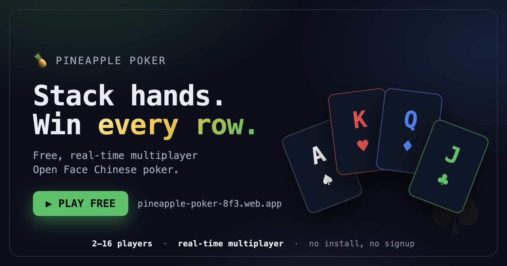
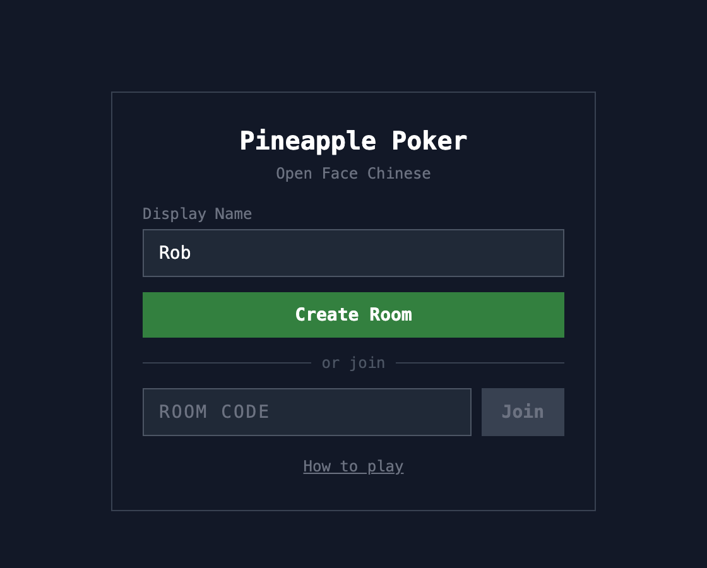
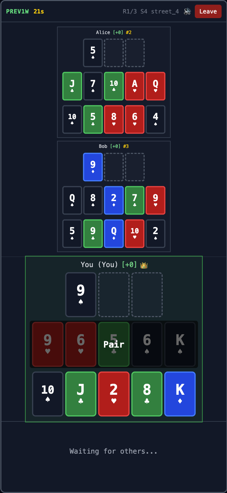
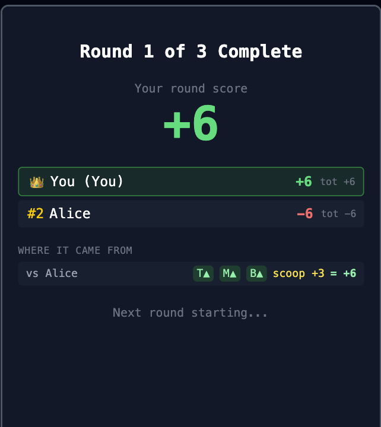
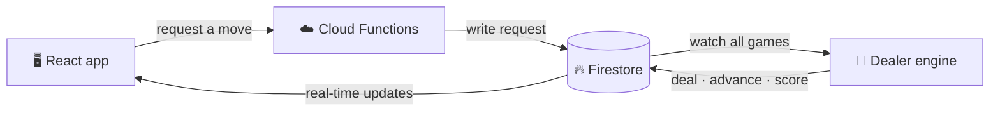

# 🍍 Pineapple Poker

### Stack three poker hands and win every row.

A free, real‑time, multiplayer **Open Face Chinese Pineapple Poker** game. Play head‑to‑head or with a full table — right in your browser. No install. No signup. Just a room code.

  

**[▶ Play now](https://pineapple-poker-8f3.web.app)** · **[How to play](#-how-to-play)** · **[Features](#-why-youll-like-it)** · **[FAQ](#-faq)**

---

## 🎴 What is it?

You're not betting chips — you're **building**. Over five quick deals you arrange 13 cards into three stacked poker hands and go row‑by‑row against everyone else at the table. Land the strongest rows, sweep your opponents, and rack up bonus **royalties** for premium hands.

The catch? Your hands have to get *stronger* as you go down — bottom beats middle beats top — or your whole board **fouls** and you bleed points to every player. One greedy placement can cost you the round. That's the whole game in a nutshell: easy to learn, agonizing to master.

> ### ▶ **[Play free at pineapple-poker-8f3.web.app](https://pineapple-poker-8f3.web.app)**
> Create a room, send the link to a friend, and you're playing in seconds. No account needed.

## 📸 A look at the table

<table>
<tr>
<td width="33%" align="center"> <b>Create or join a room</b></td>
<td width="33%" align="center"> <b>Build your board, live</b></td>
<td width="33%" align="center"> <b>See exactly how you scored</b></td>
</tr>
</table>

## ✨ Why you'll like it

- 🃏 **Quick to pick up** — if you know what a flush and a full house are, you're ready.
- 🎲 **Tense every round** — five streets of place‑two‑discard‑one decisions, then a nail‑biting reveal.
- 🏆 **Satisfying scoring** — win rows, scoop the table for a bonus, and stack royalties for big hands.
- 🧠 **Easy to learn, hard to master** — one greedy placement can foul your whole board. The depth is in the decisions.
- ⏱️ **Never waits around** — a turn timer keeps games moving; perfect for playing on stream or over a call.
- 🤖 **Play any time** — add AI bots to fill a table, or warm up solo.
- 👀 **Drop‑in friendly** — friends can join mid‑match as spectators and hop in next round.
- 🎨 **Easy on the eyes** — a four‑color deck (each suit its own color) so you read the board at a glance.
- 📱 **Plays great on your phone** — built mobile‑first, works on desktop too.

## 📖 How to play

1. **Open a room.** Create one — you'll get a 6‑character code and a one‑click invite link — or join with a code.
2. **Set the timer.** The host picks how long each turn lasts (5–120 seconds).
3. **The first deal.** You get **5 cards** — place all 5 across your three rows: top (3 slots), middle (5), bottom (5).
4. **Streets 2–5.** Each turn you're dealt **3 cards**: keep **2**, discard **1**. Keep building until all 13 slots are full.
5. **Don't foul!** A finished board has to read **bottom ≥ middle > top**. Get it backwards and you foul — −6 to every opponent. Ouch.
6. **Reveal & score.** Against each opponent: **+1** per row you win, **−1** per row you lose, **+3** if you sweep all three (a *scoop*), plus **royalties** for strong hands. The game shows you exactly where every point came from.
7. **Play it out.** A match is **3 rounds**. Highest total score takes it.

> 💡 First time with Open Face Chinese? Tap **How to play** inside the game for an interactive walkthrough.

## ❓ FAQ

<b>Is it really free?</b>
 
Yes — completely free and playable in any modern browser. No account, no download.

<b>How many people can play?</b>
 
Anywhere from 2 to 16 players in a room. Short on humans? Add AI bots to fill the table.

<b>I've never played poker like this. Can I still jump in?</b>
 
Absolutely. If you can recognize a pair, a flush, and a full house, you'll be fine. The in‑game <b>How to play</b> guide covers the rest, and there's a turn timer so nobody's left waiting while you learn.

<b>What makes Open Face Chinese different from regular poker?</b>
 
There's no betting and no bluffing — every card is placed in the open. The skill is in <i>where</i> you commit each card across your three rows, knowing you can't move it later and that one misordered board fouls the whole thing. Pure decisions, no chips.

<b>Can I play on my phone?</b>
 
Yep — it's built mobile‑first and runs great on phones, tablets, and desktops.

<b>Found a bug or have an idea?</b>
 
Please <a href="https://github.com/RobertCorey/pineapple-poker-v2/issues/new?template=bug_report.yml">report a problem</a> or <a href="https://github.com/RobertCorey/pineapple-poker-v2/issues/new?template=feature_request.yml">suggest a feature</a> — player feedback shapes what gets built next. You can also swing by <a href="https://github.com/RobertCorey/pineapple-poker-v2/discussions">Discussions</a>.

---

### Ready to deal in?

Made with 🍍 by <a href="https://github.com/RobertCorey">Rob Corey</a> · See <a href="https://github.com/RobertCorey/pineapple-poker-v2/releases">what's new</a> · <a href="LICENSE">MIT licensed</a>

🛠️ Under the hood (for the curious)

 

Built as a TypeScript monorepo with a server‑authoritative design — clients only *request* moves while a persistent dealer process owns every state transition.

| Layer | Tech |
|-------|------|
| Frontend | React 19 · TypeScript · Vite · Tailwind CSS |
| Backend | Firebase Cloud Functions |
| Game engine | Dealer service (Node.js) — sole state authority |
| Database | Cloud Firestore (real‑time) |

